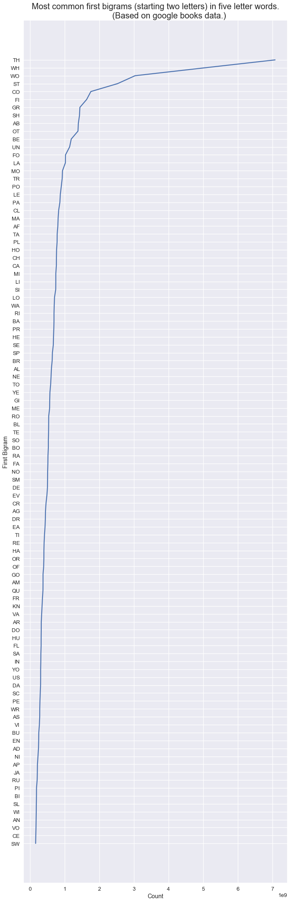

# Plans and Overview

Please refer to the new conventions that I have outlined in [the conventions and constants file](conventions_and_constants).

### General Ideas

I think the most impactful (and well-supported) result from the 1st experiment was that the first and last bigrams were highly informative of the solution to the anagram, as compared to the second and third, i.e., middle bigrams. This hypothesis is especially supported by gazes on the first and last bigrams occurring near the moment of reaching a solution, as measured by those gazes occurring closer to the end of solved trials, which was the case for *every word for both the first and last bigrams except for just one* (the first bigram of the anagram power). 

I have colored in orange the three anagrams with unreliably low sample sizes (<6), which should be excluded from this analysis. 

The middle bigrams did not show this overall effect. Our result has deep connections with a rich set of discoveries about how the "[first and last letters of words are more important than the interior letters during reading](https://www.researchgate.net/publication/232609640_The_importance_of_first_and_last_letter_in_words_during_sentence_reading)". Our result provides an independent line of evidence in agreement with these reading studies, and, in combination with them, potentially suggests an overall theory that internal word representations are weighted towards their beginnings and ends. 

Part of why I believe we should calibrate the difficulty of the second part is to shape our experimental design around this specific result that we want to strengthen. By standardizing the difficulty of the anagrams for the participants in the second round, we will obtain letter sequences of reasonable length (not very short and unanalyzable; but also, not very long and clueless/random). In addition, the trials will have an overall reasonable probability of a solution (~60%). We want greater than 50% because solved trials are inherently more interesting than unsolved trials, but less than 70-80% because we need unsolved trials to compare with. I believe this last point is very important as in the fall 2019 experiments, about 80-90% of the 5-letter words were solved and 20-60% of the 6-letter words were solved. The asymmetry in the large proportion of solved five-letter words is somewhat problematic in that it reduces the power of statistical tests that compare solved to not solved. 

### Additions to Data Parameters and Data Pipeline

I am working on a new data pipline. I'm including all available data readings. Please refer to the [clean](clean_fall_2019.ipynb) and [prepare](prepare_fall_2019.ipynb) notebooks. Eventually, I'm thinking the letter sequence generation would have two main parameters: 1. Radius around the center of the letter. 2. Minimum time spent within the circle around the letter, (or combined time if moving in and out of the circle before looking at another circle), i.e. dwell duration. The minimum time helps prevent non-fixations, and cuts away the first peak in the attached image of dwell durations, as shown below.

Then we could quickly generate all the measurements over the 2d grid of all pairs of maximum radius and minimum dwell duration parameter values (within a reasonable range). Then, all the relevant statistics would be run for each pair in the 2d grid. This way, we could obtain a better insight into the optimal thresholds for radius and dwell duration - whatever that might mean. We could also create 2d/3d plots of certain statistics based on these parameters, which could potentially be interesting. 

#### Each letter in the letter gaze sequence (LGS) should be accompanied by:

1. The subject's pupil size (could be the pupil size in mm (or whatever the units are), in addition, z-score/percentile/ratio-to-median of pupil size for that particular subject, or that particular subject-trial). 

2. The dwell duration (time spent gazing on that letter)

3. The time spent between gazing on that letter and the letter directly before, i.e. the travel duration. (This way the sum of the dwell durations and travel durations will be equal to the time of the trial, minus the time spent between gazing at the very last letter in the LGS and the end of the trial.)

3. The average distance from the center of the letter.

(We could then run more detailed statistics in relation to these accompanying values.) 

4. The normalized location in the LGS. (Given as a real number between 0 and 1)

5. The normalized time in the trial. (Also given as a real number between 0 and 1)

Probably the best way to store these is a NumPy matrix where the features above are columns and each letter in the LGS is a row. I would use your 'analyze_letter_seq.ipynb' file as a point of reference for this. 

### Additional Statistics

With the normalized location/time data, we could set a minimum of at least 20 letters or 15 seconds (whatever the relevant equivalency is). 

One issue with the statistics we've run previously was that we only used the welch's t-test to compare whether the average location of the nth bigram in solved trials is significantly greater than the average location of the nth bigram in unsolved trials, however, the welch's test assumes the average locations are normally distributed. This is assumption is somewhat reasonable by the central limit theorem, but we should additionally make the comparison without assuming normality. The obvious choice then is to use the Mann-Whitney U test, which compares if one distribution is stochastically greater than the other (whether a randomly drawn data from one distribution has a > 50% probability of being greater than a randomly drawn data from the other distribution). Additionally, this test is more resistant to the presence of outliers. We will run the Mann-Whitney U tests of the average location of each of the bigrams (first, second, third, and last)  in solved vs unsolved trials exactly as we did in the poster using Welch's t-test. 

Hopefully, we will see as we did before that the first and last bigrams are significantly closer to the end of solved trials vs unsolved trials, and the second and third bigrams are not. Then, we could compare the locations of the bigrams for solved trials to answer questions like: Is the first bigram location in solved trials significantly greater than the last bigram location in solved trials (is the first bigram more informative than the last bigram)? Is the first bigram location in solved trials significantly greater than the second bigram location in solved trials (is the first bigram more informative than the second bigram)? There are two ways of going about these comparisons: 1. Pairwise t-tests/u-tests with a correction for [multiple comparisons](https://en.wikipedia.org/wiki/Multiple_comparisons_problem) (Bonferonni correction is one we could use, it's on the conservative side, though). 2. ANOVA using the F test (assumes normality) as well as Kruskal-Wallis (the ANOVA analog of the u-test). These tests would give us a way to characterize the differences between the informative-ness of the first, second, third, and last bigrams. 

For the likelihood of reading a particular bigram through the letter sequence, we ran t-tests on each quintile, which, again, assumes normality. Instead, we could bootstrap resample over 1000 iterations for each quintile and obtain a 95% confidence interval. We could also smooth the bootstrap by adding some normally distributed random noise to each bootstrap sample, which would help reduce the effect of outliers and reduce the discreteness of samples. I don't necessarily view this analysis as a priority, so to speak, because it falls more under the domain of gradual solution knowledge formation which is not our main point. 

One other potential idea is to do some sort of Markov chain analysis of the letter sequences, it's something that's very vague as of now, but I'll be thinking a bit about it and look more into it. 

We could also discuss the mutual information component, even if it's a non-result, (negative results are often just as important as positive results), or perhaps slightly different or more constrained analysis could reveal some relevance of the mutual information. 

### Second Experiments Design

#### Two parts

As I discussed before, I think part 1 should be diagnostic in nature, to assess the ability of the student to solve anagrams. Part 2 will then be either easy, medium, or hard. About 50% of subjects would go on to the medium section, and about 25% would go on to the easy or hard section. The easy/medium and medium/hard would overlap in words so that we get as much data as we can per word. We would also re-use all the words from experiment 1. 

There is a possibility that we will miscalibrate the difficulty of some sections and discover in the early experiments that, say, Part 1 is too easy and therefore does not work well as a diagnostic test. Or perhaps, the hard section of part 2 is too challenging and the medium section of part 2 too easy. We will want to continue to make tweaks as necessary to ensure the reasonable letter sequence length and probability of solving, as described earlier. With the MATLAB code I wrote, it will be very easy to change the contents of the section and generate the stimuli in different folders. Any changes in these scenarios would center more on moving around anagrams between sections rather than adding or subtracting words from the experiment. Another likely possibility is that we would need to alter the criteria for moving to the easy/medium/hard part based on the performance in the first part. As long as we document the changes we make, it shouldn't really be an issue. 

#### Choosing words based on difficulty

In the Mayzner papers, there seem to be two relevant effects on solution-word difficulty: The sum of the frequencies of the individual bigrams in the word (called the diagram frequency of the word), as well as the overall frequency (the frequency of the word in books). Mayzner provides this information for the words he used in experiments, and, importantly, their median solution time in his experiments. I think we could re-use his words (although they are all five-letter words). I would like to calculate the diagram frequency and overall frequency of all the words we will be using from the 1st experiment as well as the new ones in the 2nd experiment, as a measure of expected difficulty based on the Mayzner papers. Soon, I would like to outline the 2nd experiment in terms of having the words we will be using in the first part as well as the three sections of the second part. In addition, I would like to make an excel sheet of the diagram frequency, overall frequency, median solution times (as we measured in the first experiment and the Mayzner experiments), percent we expect participants to get correct based on the time-limits we will set, etc. 

We might want some of the six-letter words to have two solutions rather than just one.  

#### Unsolvable anagrams

- I think that for these, we should show everyone the same two unsolvable anagrams. We should have a very clear and simple hypothesis that we're testing so that we're virtually guaranteed a result/non-result. 
- Rather than deal with the complication of comparing two different bigrams (across four letters) where you run into issues of different frequencies, etc. I think we should test how early in the trial and how frequently the subjects look at a particular bigram vs the same bigram backward, e.g., TH vs HT. We should choose two-letter combinations such that the forward bigram is far more common than the backward common (we could use starting bigrams in five-letter words from the Mayzner data to obtain these - to control for common bigrams that are really mostly part of common trigrams, i.e., ng of ing, and common bigrams that are really mostly common two-letter words, i.e., it or he). I've attached these as an image (in the appendix at the bottom) - from [this notebook file](https://github.com/jessebmurray/eyetracking/blob/master/ngrams/ngrams.ipynb). Overall, we could have four of these bigrams (two for each unsolvable anagram). 
- The unsolvable anagrams would be five-letters instead of six-letters for two reasons: 1. There are 20 instead of 30 possible bigrams to look at and therefore we would get more data on the 4 particular bigrams we desire data on, e.g., TH, HT, WH, HW. 2. The letters on the screen would be farther apart, yielding higher resolution data - as we're all very familiar with. 
- One of the unsolvable anagrams would be towards the beginning of the experiment (early part 1) and one would be towards the end (middle part 2, and make sure the participants get to it). We would shuffle 

### Misc

* Include the pop-out vs non-pop-out question after each solved trial - exactly how Ellis has it in her paper. This could be very useful later in the analysis. 
* The participants press the space bar immediately when they have a guess, and the person running the experiment would confirm whether the guess was correct or not. If incorrect, the person running the experiment writes down the guess. If correct, a different button is pressed, e.g. a mouse click, to move to the next image. This way, we have the exact instant of the guess or solution. 
* The break/rest image could be something other than a black screen. It was problematic in that sometimes subjects thought the dark screen meant the experiment was over and started to move from the chair. Or maybe, because we're doing the phase 1 and phase 2 there would be no break image. 
* Because so many people have asked for it at the Conference as well as at the Day of Scholars event, we could ask subjects in a post-experiment survey to state their 'Sex assigned at birth' and, possibly in addition, 'self-identified gender'. 
* I think the candy was a motivator (to perform well in the experiment as well as to show up in the first place) - and we could give some of the candy to the subjects after the first phase, and they'd have the option to have some of it then, this could [improve their focus](https://www.researchgate.net/publication/5535993_Toward_a_Physiology_of_Dual-Process_Reasoning_and_Judgment_Lemonade_Willpower_and_Expensive_Rule-Based_Analysis) and thereby improve our data. (We would want to make a note of whether or not they ate the candy in between phases.) We would probably have to do things differently because of the pandemic (find some way to follow sanitation protocols, no-contact, etc.)
* We may want to place extra emphasis in the prompt that the subjects agree not to talk about the experiment with others. 

### Appendix

